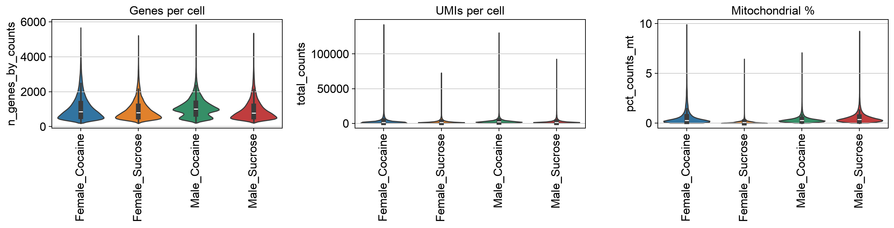
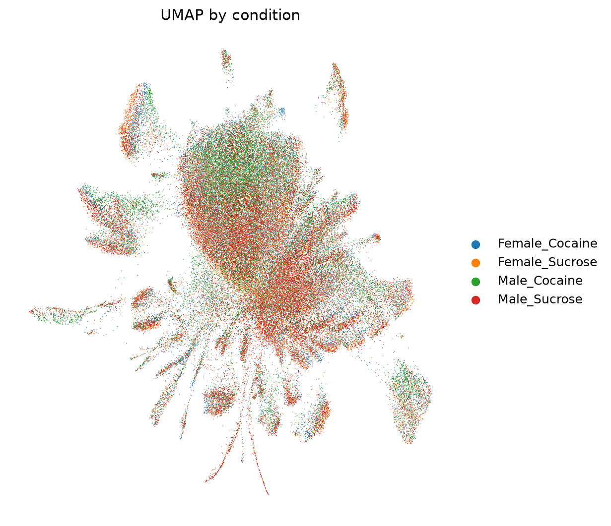
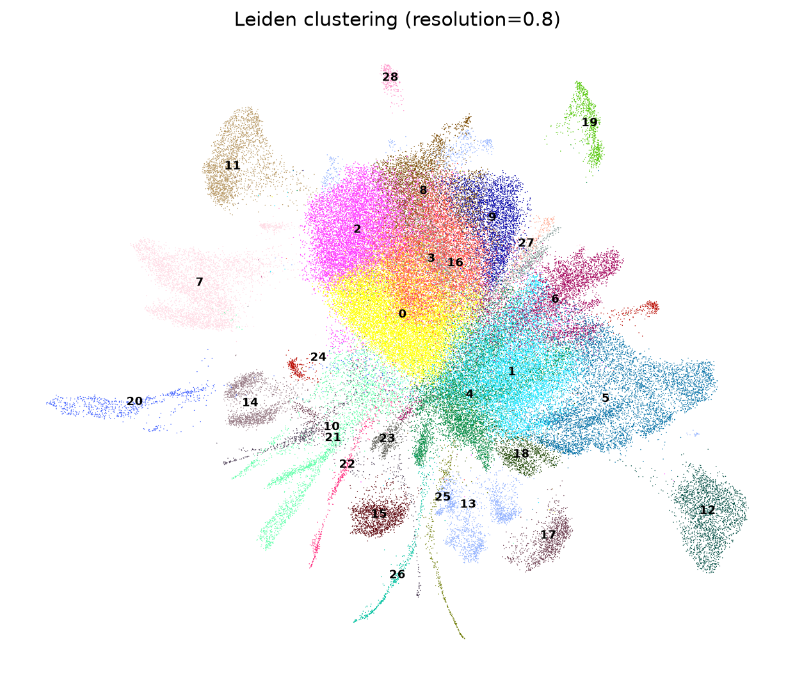
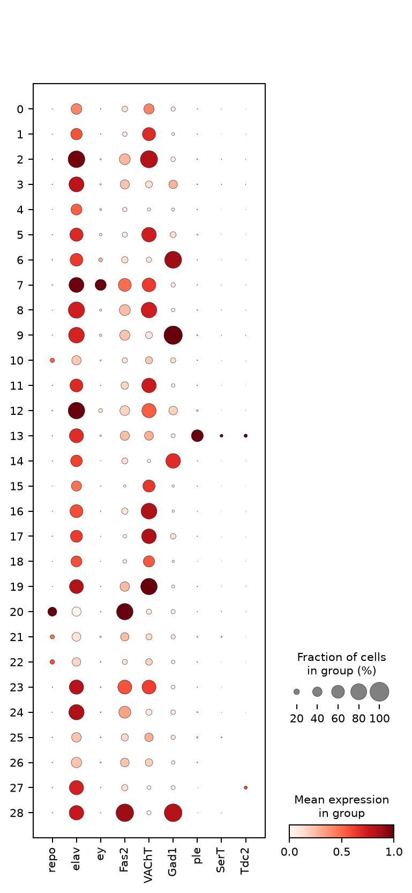
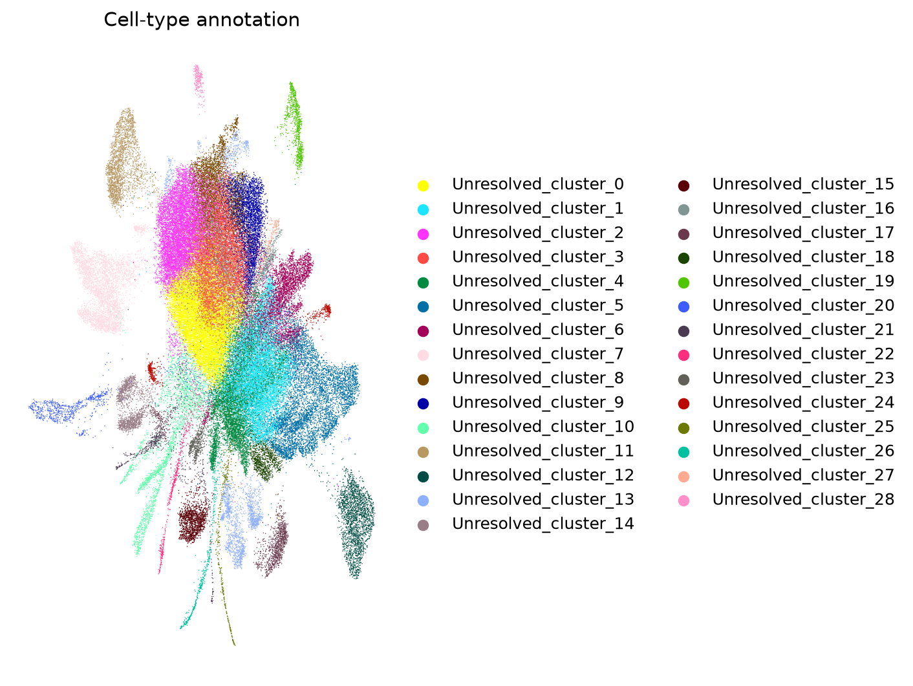
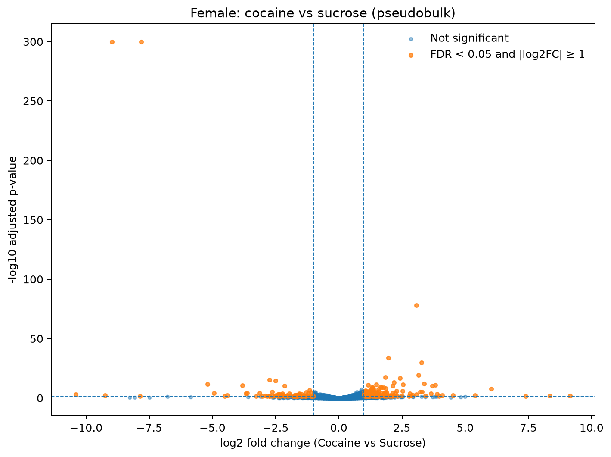
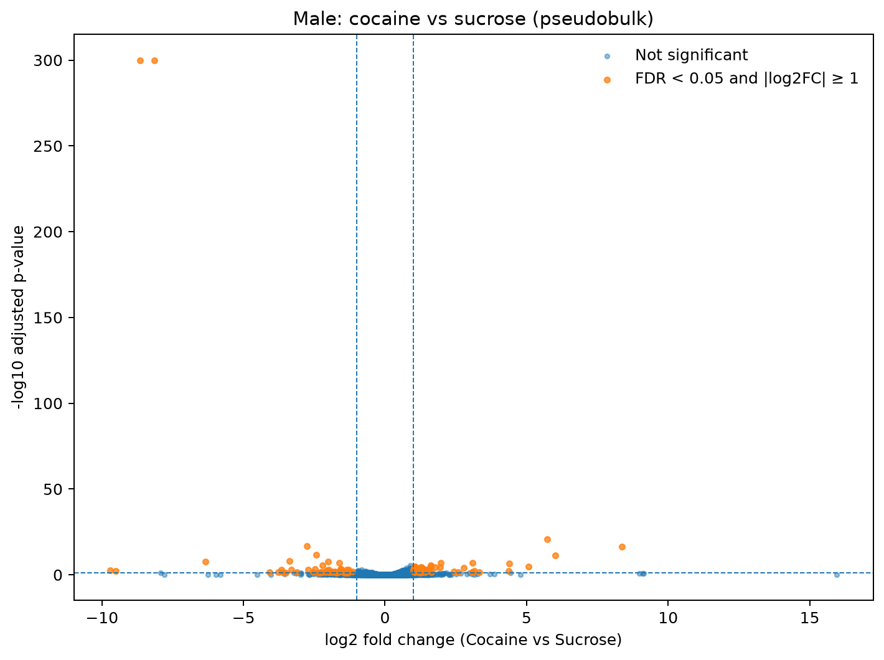
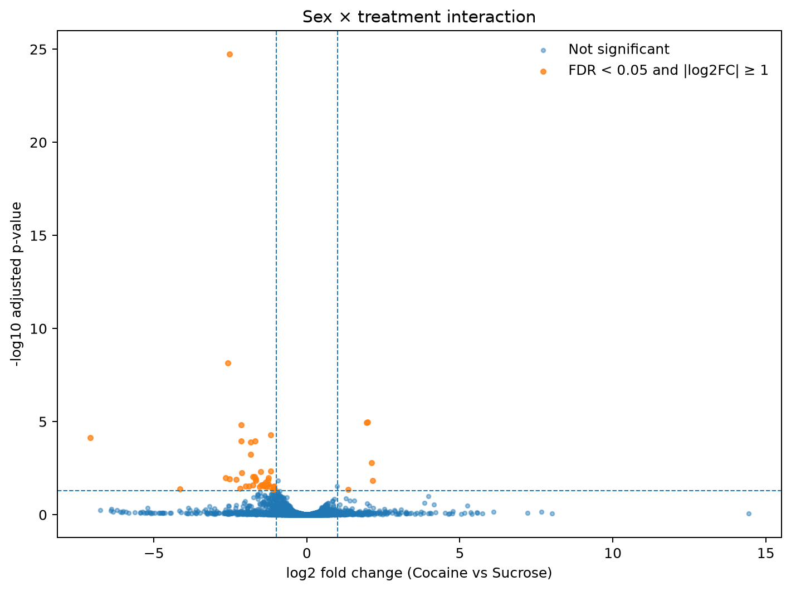

# Drosophila Brain Cocaine Response — Single-Cell RNA-seq Reanalysis

**Group Leader:** Tanvir Ahmed  
**Team Members:** Mantuka Masnoon Umama, Sharfuddin Safin, Tasnim Haque Achal, Suriya Akther, Mahi Kabir Chowdhury, Nahid Hasan, Mobin Ibne Mokbul, Md. Tariqul Islam, Nowshin Tarannum Adriana  
**Repository:** https://github.com/tanvirahmed-dr/scproject2-drosophila-brain

---

## Abstract

Cocaine exposure produces behavioral and neurochemical changes across species, while the extent to which transcriptional responses differ between sexes remains an important biological question. Bainton et al. generated single-cell RNA-seq data from whole *Drosophila melanogaster* brains following cocaine or sucrose exposure in male and female flies (GEO: GSE152495), resolving a brain-wide atlas of approximately 36 transcriptionally distinct clusters. We reanalyzed the same 8-sample dataset using a reproducible Scanpy workflow for quality control, normalization, dimensionality reduction, Leiden clustering, marker-based annotation, and sample-level differential expression. The differential-expression analysis was revised to use pseudobulk counts aggregated within biological samples and a full 2×2 sex-by-treatment model, with an explicit sex × treatment interaction contrast.

After QC, the final object contained 88,922 cells and 11,946 genes. Leiden resolution 0.8 produced 29 clusters and was retained as the final clustering resolution after comparison with resolutions 0.5, 1.0, and 1.2. Nine of ten canonical markers were recovered for marker analysis, with `VGlut` unavailable. In the revised pseudobulk analysis, 246 genes were significant for cocaine versus sucrose in females, 109 were significant in males, and 46 met the significance and effect-size thresholds for the sex × treatment interaction. Importantly, the male and female significant-gene counts are descriptive summaries; the interaction contrast is the direct statistical test of whether the treatment response differs between sexes. No FlyBase phenotype-enrichment terms reached adjusted p < 0.05 for either sex.

These results replace the previous cell-level differential-expression results. The revised analysis avoids treating individual cells as independent biological replicates and provides a direct test of sex-dependent treatment response.

---

## 1. Introduction

Cocaine alters monoaminergic signaling and neuronal activity, producing behavioral and molecular changes in nervous tissue. *Drosophila melanogaster* provides a useful model for studying these processes because its nervous system contains conserved neurotransmitter systems and can be profiled at single-cell resolution.

Bainton et al. used single-cell RNA sequencing of whole *Drosophila* brains from male and female flies exposed to cocaine or sucrose control and reported sex- and cell-type-associated transcriptional responses. The dataset used here is GEO GSE152495 and contains eight biological samples: Female_Cocaine (2 replicates), Female_Sucrose (2 replicates), Male_Cocaine (2 replicates), and Male_Sucrose (2 replicates).

The project had two main objectives:

1. Reproduce a biologically interpretable whole-brain single-cell atlas using a Scanpy workflow.
2. Quantify cocaine-associated transcriptional changes while treating the biological sample, rather than the individual cell, as the inferential unit and directly testing the sex × treatment interaction.

A major revision of the original project workflow was therefore made for differential expression. The earlier cell-level `rank_genes_groups` analysis was replaced by sample-level pseudobulk aggregation and DESeq2-style negative-binomial modelling.

---

## 2. Methods

### 2.1 Dataset

The analysis uses 8 samples from GEO GSE152495:

- Female_Cocaine_1
- Female_Cocaine_2
- Female_Sucrose_1
- Female_Sucrose_2
- Male_Cocaine_1
- Male_Cocaine_2
- Male_Sucrose_1
- Male_Sucrose_2

Each sample is a 10x Genomics single-cell RNA-seq run of whole *Drosophila* brain tissue.

### 2.2 Quality Control and Filtering

Cells were filtered independently within each sample using `min_genes=200`, and genes were retained using `min_cells=3`, before the eight samples were merged. This order of operations was chosen to reduce peak memory use during concatenation.

Mitochondrial content was calculated using the Drosophila-specific `mt:` gene prefix. Cells with more than 10% mitochondrial reads were excluded. Genes with missing/`NaN` symbols in the 10x feature annotation were removed before downstream analysis.

The resulting final normalized object contained **88,922 cells and 11,946 genes**.

### 2.3 Normalization and Feature Selection

Counts were normalized to 10,000 total counts per cell and log-transformed using `normalize_total` followed by `log1p`. The top 2,000 highly variable genes were selected with sample-aware HVG selection and were used for scaling, PCA, and neighborhood construction.

Variance regression (`regress_out`) was omitted because the analysis was performed in an 8GB RAM environment and the operation produced excessive memory demands. This limitation applies primarily to the dimensionality-reduction/clustering workflow. The differential-expression effect sizes were not calculated from the scaled matrix.

### 2.4 Clustering and Resolution Assessment

PCA was performed using 30 components, followed by neighborhood construction with `n_neighbors=15` and UMAP embedding. Leiden clustering was evaluated at four resolutions: 0.5, 0.8, 1.0, and 1.2.

A reproducible random sample of 5,000 cells was used to calculate silhouette scores in the first 30 PCA dimensions. The resulting comparison was:

| Leiden resolution | Clusters | Silhouette score | Sample size |
|---:|---:|---:|---:|
| 0.5 | 21 | 0.083912 | 5,000 |
| 0.8 | 29 | 0.076869 | 5,000 |
| 1.0 | 32 | 0.076761 | 5,000 |
| 1.2 | 34 | 0.078907 | 5,000 |

Resolution **0.8** was retained for the final annotation because it preserved the project's intended balance between cluster granularity and biological interpretability while remaining reasonably comparable with the published atlas. The quantitative assessment is retained in `results/tables/clustering_resolution_comparison.csv`.

### 2.5 Cell-Type Annotation

Canonical marker genes were examined using a marker-specific representation of the full expression matrix. The marker panel was:

- `repo` — glial marker
- `elav` — pan-neuronal marker
- `ey` and `Fas2` — Kenyon-cell-associated markers
- `VAChT` — cholinergic marker
- `Gad1` — GABAergic marker
- `VGlut` — glutamatergic marker
- `ple` — dopaminergic marker
- `SerT` — serotonergic marker
- `Tdc2` — octopaminergic marker

Nine markers were available: `repo`, `elav`, `ey`, `Fas2`, `VAChT`, `Gad1`, `ple`, `SerT`, and `Tdc2`. `VGlut` was not found. Marker expression was visualized in the final dot plot, and cluster-level mean marker expression was saved as `cluster_marker_mean_expression.csv`.

The annotation was deliberately conservative: the notebook retains unresolved cluster labels unless a cluster is assigned a biological label based on the marker inspection.

### 2.6 Sample-Level Pseudobulk Differential Expression

The differential-expression workflow was revised to avoid treating cells from the same biological sample as independent replicates. Raw counts were aggregated across cells within each biological sample to create a sample-by-gene pseudobulk count matrix.

The analysis retained **9,557 genes** after the minimal count filter. Unlike the clustering workflow, DE was therefore performed using the retained genes rather than restricting the analysis to the 2,000 HVGs.

A full 2×2 model was fitted using PyDESeq2 with the design:

`~ sex + treatment + sex:treatment`

with Female and Sucrose as the reference levels. The model contains:

- an intercept;
- a male main-effect coefficient;
- a cocaine treatment coefficient at the female reference level;
- a male × cocaine interaction coefficient.

Three contrasts were extracted:

1. **Female cocaine vs sucrose:** treatment effect at the female reference level.
2. **Male cocaine vs sucrose:** treatment effect in males, represented by the treatment coefficient plus the interaction coefficient.
3. **Sex × treatment interaction:** direct test of whether the cocaine treatment effect differs between males and females.

A gene was counted as significant when **Benjamini–Hochberg adjusted p < 0.05 and |log2FC| ≥ 1**.

### 2.7 Fold-Change Integrity Audit

The final fold-change audit evaluated all three contrasts. All 9,557 tested genes had finite log2 fold-change values in each contrast. No non-finite log2FC values were included in the significant-DE sets.

### 2.8 Pathway Enrichment

Significant DE genes from the female and male treatment contrasts were tested separately using GSEApy/Enrichr against the fly-specific `Allele_LoF_Phenotypes_from_FlyBase_2017` library.

Enrichment results were divided into significant and non-significant terms using adjusted p < 0.05. When no significant terms were present, no enrichment bar plot was generated; the complete results remain available in the CSV output tables.

---

## 3. Results

### 3.1 Quality Control

The final QC/normalized object contained **88,922 cells and 11,946 genes**. Figure 1 summarizes the distributions of detected genes, total counts, mitochondrial percentage, and ribosomal percentage across the experimental samples.

### 3.2 Clustering and Cell-Type Annotation

At the selected Leiden resolution of 0.8, the analysis identified **29 clusters**. The resolution comparison showed 21, 29, 32, and 34 clusters at resolutions 0.5, 0.8, 1.0, and 1.2, respectively.

The marker analysis recovered nine of the ten canonical markers tested, with `VGlut` unavailable. Marker expression supported the identification of major glial and neuronal populations, while unresolved labels were retained where the available marker evidence was insufficient.

### 3.3 Differential Expression: Cocaine vs Sucrose

The revised pseudobulk analysis tested 9,557 genes using the sample-level count matrix and the full sex × treatment design.

| Contrast | Significant genes |
|---|---:|
| Female cocaine vs sucrose | **246** |
| Male cocaine vs sucrose | **109** |
| Sex × treatment interaction | **46** |

Significance required FDR < 0.05 and |log2FC| ≥ 1.

The **246 versus 109** values are treatment-response counts within the two sexes and should be interpreted descriptively. They are not, by themselves, a statistical comparison of male and female responses. The **46 significant interaction genes** are the genes for which the fitted cocaine effect differs between sexes according to the explicit interaction contrast.

### 3.4 Fold-Change Integrity

The fold-change audit found:

| Contrast | Genes tested | Non-finite log2FC | Significant genes |
|---|---:|---:|---:|
| Female treatment | 9,557 | 0 | 246 |
| Male treatment | 9,557 | 0 | 109 |
| Sex × treatment interaction | 9,557 | 0 | 46 |

This confirms that the final significant-DE sets were not produced by silently retaining undefined fold changes.

### 3.5 Pathway Enrichment

No FlyBase loss-of-function phenotype terms reached adjusted p < 0.05 for either the male or female significant treatment-response gene set.

Therefore, the revised analysis does **not** support reporting the previously described male enrichment terms such as “mating defective” or “sleep defective,” nor the previously described female photoreceptor, neuroblast, or tissue-primordium terms as significant findings from the final pipeline. Those descriptions belong to the earlier analysis and have been removed from the revised interpretation.

The complete enrichment output is retained in:

- `male_pathway_enrichment_all.csv`
- `male_pathway_enrichment_significant.csv`
- `male_pathway_enrichment_nonsignificant.csv`
- `female_pathway_enrichment_all.csv`
- `female_pathway_enrichment_significant.csv`
- `female_pathway_enrichment_nonsignificant.csv`

Because the significant tables are empty, no final enrichment figure is included in the revised results.

---

## 4. Discussion

### 4.1 Clustering

The final clustering resolution was 0.8, producing 29 clusters. The published atlas contains approximately 36 clusters, while the present workflow produced 32 and 34 clusters at resolutions 1.0 and 1.2. The resolution comparison demonstrates that cluster number increases with resolution, while the sampled PCA-space silhouette scores remain relatively close across the tested settings.

The final resolution was retained at 0.8 to balance cluster granularity with interpretability and project comparability rather than selecting a resolution solely because it produces a cluster count close to the published value. Differences in QC, omitted variance regression, preprocessing, and clustering implementation can all affect the exact number of Leiden communities.

### 4.2 Revised Differential-Expression Analysis

The most important methodological revision is the change from cell-level differential expression to sample-level pseudobulk analysis. Individual cells originating from the same biological sample are not independent biological replicates. Aggregating counts within each sample and fitting a negative-binomial model therefore provides an analysis aligned with the experimental replication structure.

The revised analysis identified 246 significant female treatment-response genes, 109 significant male treatment-response genes, and 46 significant sex × treatment interaction genes under the predefined FDR and effect-size thresholds.

The difference between 246 and 109 should not be converted into a claim that the female or male response is statistically stronger on the basis of gene counts alone. The appropriate comparison is the interaction contrast. The 46 interaction genes represent genes for which the estimated cocaine treatment effect differs between the two sexes under the fitted model.

These results replace the previous cell-level result of 50 male and 46 female genes. The earlier values were generated by a different inferential framework and are not directly comparable with the revised pseudobulk counts.

### 4.3 Pathway Enrichment

The final enrichment analysis yielded no FlyBase phenotype terms with adjusted p < 0.05 for either sex. Consequently, biological interpretations based on specific enrichment terms from the previous workflow are not retained in this report.

This null enrichment result should be treated as an analysis outcome rather than evidence that cocaine has no biological effect. Enrichment depends on the size and composition of the input gene set, the reference library, and the statistical threshold. The present result specifically indicates that the tested male and female significant DE sets did not produce adjusted-p-significant terms in the selected FlyBase library under the implemented analysis.

### 4.4 Statistical and Experimental Considerations

There are **two biological replicates per sex × treatment combination** in the dataset. Although pseudobulk modelling correctly uses samples as the inferential units, the small number of biological replicates limits the precision and statistical power of the experiment. The interaction result should therefore be interpreted in the context of this replication structure.

A useful follow-up analysis would be to examine cell-type-specific pseudobulk responses, provided that sufficient cells and appropriate sample-level replication are available within each cell type. Such an analysis could determine whether interaction effects are concentrated in particular neuronal or glial populations.

---

## 5. Limitations

1. **Limited biological replication:** There are two biological replicates for each sex × treatment combination, which limits statistical power and precision for sample-level inference.
2. **No variance regression:** `regress_out` was omitted because of the memory limitations of the analysis environment. Residual technical variation may therefore remain in the dimensionality-reduction workflow.
3. **Cluster resolution:** The final resolution of 0.8 produced 29 clusters, fewer than the approximately 36 reported in the reference study. Higher tested resolutions produced 32 and 34 clusters but were not selected as the final resolution.
4. **Marker availability:** `VGlut` was not recovered in the available feature set used for marker analysis, limiting direct glutamatergic-marker confirmation.
5. **Whole-brain aggregation for DE:** The revised DE analysis is sample-level and whole-brain rather than cell-type-specific. Cell-type-specific effects may therefore be diluted when aggregated across the complete brain.
6. **Enrichment library:** Pathway analysis was restricted to the selected FlyBase loss-of-function phenotype library; absence of significant enrichment in this library does not exclude enrichment in other biological databases.

---

## 6. Conclusion

This reanalysis provides a revised and statistically appropriate sample-level differential-expression workflow for the GSE152495 *Drosophila* brain dataset. The final object contains 88,922 cells and 11,946 genes, with 29 Leiden clusters at resolution 0.8. The revised pseudobulk analysis tests 9,557 genes and identifies 246 female treatment-response genes, 109 male treatment-response genes, and 46 genes with a significant sex × treatment interaction under FDR < 0.05 and |log2FC| ≥ 1.

The principal conclusion is methodological as well as biological: sex-specific treatment effects should be evaluated using the explicit interaction contrast rather than by comparing the number of significant genes between males and females. The final analysis also finds no adjusted-significant FlyBase phenotype-enrichment terms in either sex. These results supersede the earlier cell-level DE and pathway-enrichment findings in this project.

---

## 7. References

1. Bainton, R.J. et al. Single-cell transcriptomic profiling of the *Drosophila* brain reveals sex-specific and cell-type-specific responses to cocaine. GEO: GSE152495.
2. Wolf, F.A., Angerer, P. & Theis, F.J. SCANPY: large-scale single-cell gene expression data analysis. *Genome Biology* 19, 15 (2018).
3. Traag, V.A., Waltman, L. & van Eck, N.J. From Louvain to Leiden: guaranteeing well-connected communities. *Scientific Reports* 9, 5233 (2019).
4. Chen, E.Y. et al. Enrichr: interactive and collaborative HTML5 gene list enrichment analysis tool. *BMC Bioinformatics* 14, 128 (2013).

---

## Appendix: AI Usage Disclosure

**Tool used:** Claude (Anthropic), Sonnet 4.6, accessed via claude.ai chat interface.

**Purpose:** Assistance with Scanpy pipeline structure and code, debugging runtime errors (memory/OOM issues, dependency errors, and indexing errors from missing gene symbols), git/GitHub workflow setup, and drafting the report structure.

**Scope of use:** The analysis code was reviewed, executed, and validated by the group leader before inclusion. Design decisions including QC thresholds, clustering resolution, and memory-related omissions were made by the author based on observed analysis outputs.
