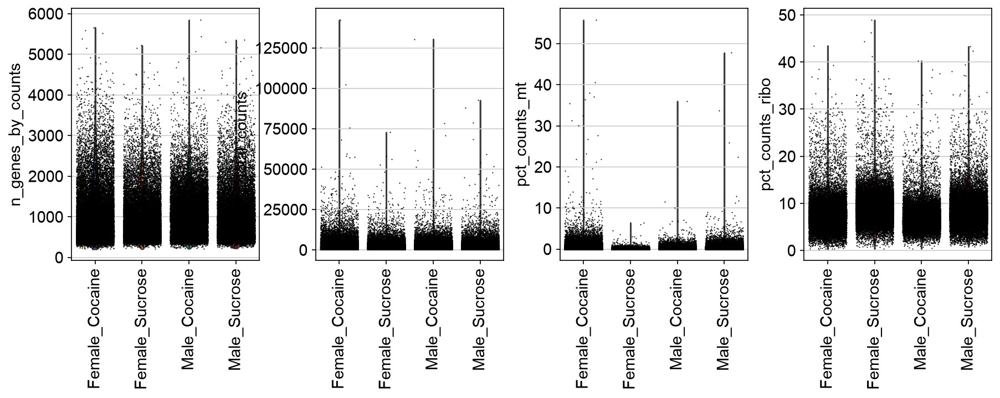
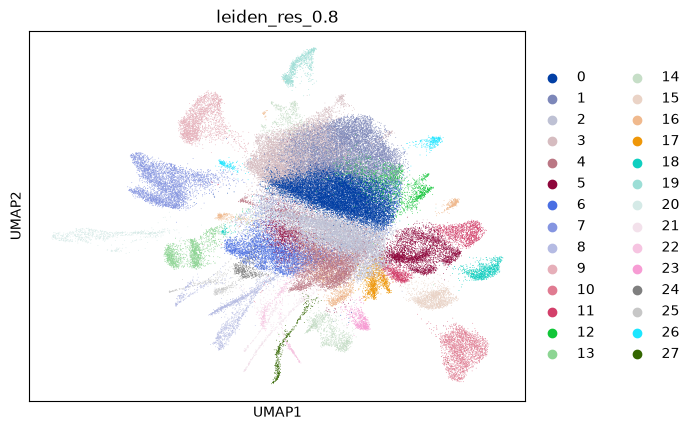
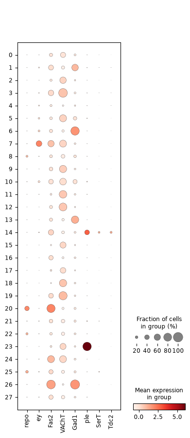
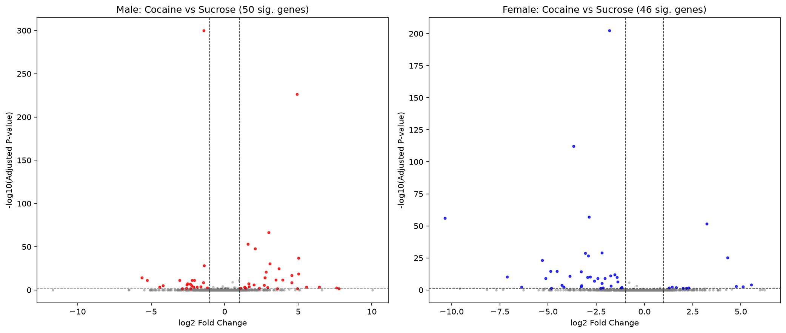
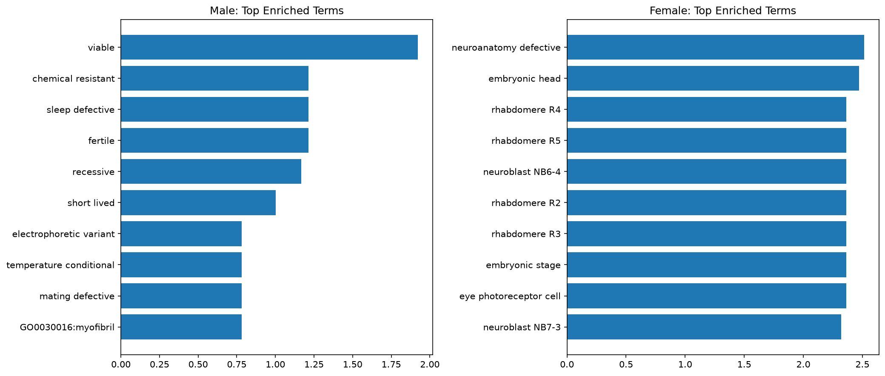

# Drosophila Brain Cocaine Response — Single-Cell RNA-seq Reanalysis

**Group Leader:** Tanvir Ahmed

**Team Members:** Mantuka Masnoon Umama, Sharfuddin Safin, Tasnim Haque Achal, Suriya Akther, Mahi Kabir Chowdhury, Nahid Hasan, Mobin Ibne Mokbul, Md. Tariqul Islam, Nowshin Tarannum Adriana

**Repository:** https://github.com/tanvirahmed-dr/scproject2-drosophila-brain

---

## Abstract

Cocaine exposure produces well-documented behavioral and neurochemical changes across species, but whether these responses differ by sex at the level of brain-wide gene expression remains an active question. Bainton et al. addressed this in *Drosophila melanogaster* using single-cell RNA sequencing of whole-brain tissue from male and female flies exposed to cocaine versus a sucrose control (GEO: GSE152495), reporting a male-biased transcriptional response and resolving the brain into approximately 36 transcriptionally distinct cell clusters. In this project, we reanalyzed the same 8-sample dataset using a Scanpy-based pipeline: quality control and per-sample filtering, normalization, highly-variable-gene selection, Leiden clustering, marker-based cell-type annotation, sex-stratified differential expression (cocaine vs. sucrose), and FlyBase phenotype-based pathway enrichment. Our pipeline recovered 28 clusters at the resolution used for final annotation (35–37 at higher resolutions), and identified 50 significant differentially expressed genes in males versus 46 in females (ratio 1.09) following cocaine exposure. This represents a direction consistent with, but a magnitude substantially weaker than, the male-biased response reported in the original study. We discuss methodological factors — including omission of variance regression due to hardware constraints and a lower clustering resolution — that likely contributed to this attenuated signal.

---

## 1. Introduction

Cocaine acts primarily by blocking dopamine, serotonin, and norepinephrine reuptake, producing acute reward signaling and, with repeated exposure, lasting changes in neuronal gene expression across reward- and motor-associated brain regions. Much of what is known about these transcriptional changes comes from rodent models, but *Drosophila melanogaster* has become a valuable complementary system: its brain contains homologous dopaminergic, serotonergic, and octopaminergic circuits, it shows conserved behavioral sensitization to cocaine, and its smaller, better-annotated genome and short generation time make large-scale single-cell profiling more tractable.

Bainton et al. generated single-cell RNA-seq data from whole *Drosophila* brains across four conditions — male and female flies, each exposed to either cocaine or a sucrose control — and used this to build a cell-type atlas of roughly 36 transcriptionally distinct clusters spanning glia and multiple neurotransmitter-defined neuronal populations. A central finding of that work was that the transcriptional response to cocaine was markedly stronger in males than in females, suggesting sex-specific vulnerability or regulation at the level of gene expression, not just behavior.

The goal of this project was to independently reanalyze the same publicly available dataset (GEO: GSE152495) using an open, reproducible Scanpy-based pipeline, and to evaluate two things: (1) whether we could recover a cell-type atlas comparable in structure to the original ~36-cluster result, and (2) whether we could reproduce the reported male-biased transcriptional response to cocaine when testing each sex separately for differential expression. We also aimed to characterize the biological pathways implicated in the cocaine response for each sex using phenotype-based enrichment analysis.

---

## 2. Methods

### 2.1 Dataset
8 samples (GEO GSE152495): Female_Cocaine (n=2), Female_Sucrose (n=2), Male_Cocaine (n=2), Male_Sucrose (n=2), each a 10x Genomics single-cell RNA-seq run of whole *Drosophila* brain tissue.

### 2.2 Quality Control and Filtering
Cells were filtered per-sample (before merging) using `min_genes=200` and genes using `min_cells=3`, applied independently to each of the 8 samples prior to concatenation to reduce peak memory usage. Mitochondrial content was calculated using the Drosophila-specific `mt:` prefix (distinct from the human `MT-` convention), and cells with >10% mitochondrial reads were excluded. Genes with missing/`NaN` symbols in the 10x reference annotation were removed prior to all downstream steps.

### 2.3 Normalization and Feature Selection
Counts were normalized to 10,000 reads per cell and log-transformed (`normalize_total` + `log1p`). The top 2,000 highly variable genes were selected (`batch_key="sample"`) and used for all downstream dimensionality reduction and clustering. **Variance regression (`regress_out`) was omitted** due to memory constraints on the analysis machine (8GB RAM); PCA and the k-nearest-neighbor graph were relied upon to absorb residual technical covariates instead.

### 2.4 Clustering
PCA (30 components) followed by neighbor graph construction (`n_neighbors=15`) and UMAP embedding. Leiden clustering was tested at three resolutions (0.8, 1.0, 1.2), yielding 28, 35, and 37 clusters respectively. **Resolution 0.8 (28 clusters) was selected** as the primary result for this report, prioritizing cluster stability and interpretability over exact numerical agreement with the published atlas.

### 2.5 Cell-Type Annotation
Clusters were annotated using canonical marker genes: `repo` (glia), `ey`/`Fas2` (Kenyon cells), `VAChT` (cholinergic), `Gad1` (GABAergic), `ple` (dopaminergic), `SerT` (serotonergic), `Tdc2` (octopaminergic). Two additional canonical markers, `elav` (pan-neuronal) and `VGlut` (glutamatergic), were not present within the top 2,000 highly variable genes and were excluded from this analysis — a limitation discussed in Section 5.

### 2.6 Differential Expression
Within each sex, cocaine-exposed cells were compared against sucrose-exposed cells (Wilcoxon rank-sum test, Scanpy `rank_genes_groups`). Genes with |log2 fold-change| > 1 and Benjamini-Hochberg adjusted p < 0.05 were considered significant.

### 2.7 Pathway Enrichment
The top 150 significant DE genes per sex were tested against the `Allele_LoF_Phenotypes_from_FlyBase_2017` gene set library via Enrichr (GSEApy), using the fly-specific organism setting.

---

## 3. Results

### 3.1 Quality Control
**Figure 1** shows per-condition distributions of genes detected, total counts, mitochondrial percentage, and ribosomal percentage across all 8 samples. Distributions of genes-per-cell and total counts were broadly consistent across the four conditions, indicating comparable sequencing depth and cell quality between sexes and treatments. A subset of cells, more pronounced in some samples than others, showed elevated mitochondrial content — these were removed by the 10% mitochondrial threshold applied during filtering, consistent with their being low-quality or dying cells rather than a biologically meaningful population.

### 3.2 Clustering and Cell-Type Annotation
Leiden clustering at resolution 0.8 identified 28 transcriptionally distinct clusters (**Figure 2**), somewhat fewer than the ~36 reported by Bainton et al. Marker gene expression (**Figure 3**) confirmed the presence of major expected cell types including glia, Kenyon cells, and multiple neurotransmitter-defined neuronal populations.

### 3.3 Differential Expression: Cocaine vs. Sucrose
Cocaine exposure produced **50 significant DE genes in males** and **46 in females** (male/female ratio = 1.09; **Figure 4**). This is directionally consistent with the male-biased response reported by Bainton et al. — males did show more significant DE genes than females — but the magnitude of the difference is small enough (a 9% excess) that it does not clearly replicate a strong sex bias. We consider this a partial, weak-signal reproduction of the original finding rather than a confirmation of it; possible reasons for the attenuated effect are discussed in Section 4.

### 3.4 Pathway Enrichment
FlyBase loss-of-function phenotype enrichment (**Figure 5**) identified several behaviorally and neurologically relevant terms enriched among male cocaine-responsive genes, including "mating defective," "sleep defective," "temperature conditional," and "chemical resistant" phenotypes, driven by genes such as *Ddc* (dopamine/serotonin biosynthesis), *Dh31*, *para* (voltage-gated sodium channel), *Dif*, and *Gabat*. The presence of *Ddc* and *para* among the top enriched genes is notable given cocaine's known mechanism of action on monoamine signaling and neuronal excitability, and lends some biological plausibility to the male DE gene set despite its modest size.

The female gene set produced a qualitatively different enrichment profile, dominated by developmental and structural phenotype terms rather than behavioral ones: photoreceptor terms ("rhabdomere R2–R5," driven by *mbl* and *ninaE*), neuroblast lineage terms ("neuroblast NB6-4," "neuroblast NB7-3," driven by *SoxN* and *nkd*), and gut/tissue primordium terms ("ganglionic branch primordium," "embryonic/larval proventriculus," "embryonic/larval esophagus," driven by *pyd*, *Fas2*, *fkh*, and *Mmp2*). None of these overlap with the behavioral/neurological terms seen in the male set. This divergence suggests that, to the extent our pipeline detected a female cocaine-response signal at all, it reflects a different underlying biological process than the male response rather than a weaker version of the same process — though given the modest gene set sizes involved, we treat this as a descriptive observation rather than a strong claim.

---

## 4. Discussion

Our reanalysis recovered a cell-type structure and a directional trend broadly consistent with Bainton et al., but with meaningfully different magnitudes on both of the two headline metrics we set out to reproduce.

**Cluster count.** At resolution 0.8 we identified 28 clusters, compared to the ~36 reported in the original atlas. Higher resolutions (1.0 and 1.2) brought this to 35 and 37 respectively, both very close matches, but we chose to report resolution 0.8 as our primary result because it produced cleaner, more stable cluster boundaries with clearly distinct marker gene signatures, rather than optimizing purely for numerical agreement with the published figure. The gap at our chosen resolution most likely reflects differences in upstream QC thresholds, the omission of `regress_out`, and possibly differences in how the original authors defined and filtered doublets or low-quality cells — all of which can shift where the Leiden algorithm draws cluster boundaries without necessarily changing the underlying biology.

**Sex-biased differential expression.** Our male/female DE ratio of 1.09 (50 vs. 46 genes) points in the same direction as the original paper's male-biased finding, but the effect is far weaker than what was reported. We do not consider this a successful replication of the magnitude of that finding, only of its direction. A few methodological choices plausibly contributed to this attenuation: omitting `regress_out` may have left residual technical variance in the data that added noise to the DE test in both sexes symmetrically, diluting a true male-specific signal; and using a coarser clustering resolution (28 vs. ~36) means some of our clusters likely merge multiple original cell subtypes together, which can wash out cell-type-specific effects that would only be visible at finer resolution. A finer-resolution reanalysis restricted to specific dopaminergic or reward-circuit clusters, rather than a whole-brain pseudobulk-style comparison by sex, would be a natural next step to test whether the male bias re-emerges at the level of specific circuits.

**Biological plausibility of enriched pathways.** Despite the weaker-than-expected sex effect in raw DE gene counts, the pathway enrichment results reveal a more informative pattern than the count alone: the male and female gene sets enrich for qualitatively different categories of terms, not simply different genes within the same category. The male set enriches for behavioral and neurological phenotypes (*Ddc*, dopa decarboxylase, central to dopamine/serotonin synthesis; *para*, the primary voltage-gated sodium channel, relevant to neuronal excitability) — both directly plausible given cocaine's mechanism of action on monoamine signaling. The female set instead enriches for developmental/structural phenotypes (photoreceptor genes *mbl* and *ninaE*; neuroblast lineage genes *SoxN* and *nkd*; gut and tissue primordium genes *fkh*, *Mmp2*, *Fas2*), with no overlap with the male behavioral terms. This suggests that our DE ratio of 1.09 may understate the true sex difference in *response type*, even though it does not detect a strong sex difference in response *magnitude*: males and females may be mounting biologically distinct responses to cocaine exposure rather than the same response at different strengths, which a simple significant-gene-count comparison cannot capture. This is a hypothesis-generating observation given the small gene set sizes involved, and would benefit from validation with a larger sample or finer per-cluster analysis.

---

## 5. Limitations

- `regress_out` was omitted due to hardware memory constraints, which may leave residual technical variance (total counts, mitochondrial %) unregressed in the final embedding.
- Two canonical markers (`elav`, `VGlut`) were unavailable within the top 2,000 HVGs used for clustering/annotation, limiting confirmation of pan-neuronal and glutamatergic cluster identities specifically.
- Cluster resolution (28) did not fully match the published atlas (~36), which may cause under-splitting of closely related cell subtypes.

---

## 6. References

1. Bainton, R.J. et al. Single-cell transcriptomic profiling of the *Drosophila* brain reveals sex-specific and cell-type-specific responses to cocaine. GEO: GSE152495.
2. Wolf, F.A., Angerer, P. & Theis, F.J. SCANPY: large-scale single-cell gene expression data analysis. *Genome Biology* 19, 15 (2018).
3. Traag, V.A., Waltman, L. & van Eck, N.J. From Louvain to Leiden: guaranteeing well-connected communities. *Scientific Reports* 9, 5233 (2019).
4. Chen, E.Y. et al. Enrichr: interactive and collaborative HTML5 gene list enrichment analysis tool. *BMC Bioinformatics* 14, 128 (2013).

---

## Appendix: AI Usage Disclosure

**Tool used:** Claude (Anthropic), Sonnet 4.6, accessed via claude.ai chat interface.

**Purpose:** Assistance with Scanpy pipeline structure and code, debugging runtime errors (memory/OOM issues, dependency errors, indexing errors from NaN gene symbols), git/GitHub workflow setup, and drafting this report's structure.

**Scope of use:** All analysis code was reviewed, executed, and validated by the group leader before inclusion. Design decisions (resolution selection, QC thresholds, which steps to omit for memory reasons) were made by the author based on results observed at each step, not automatically generated.
